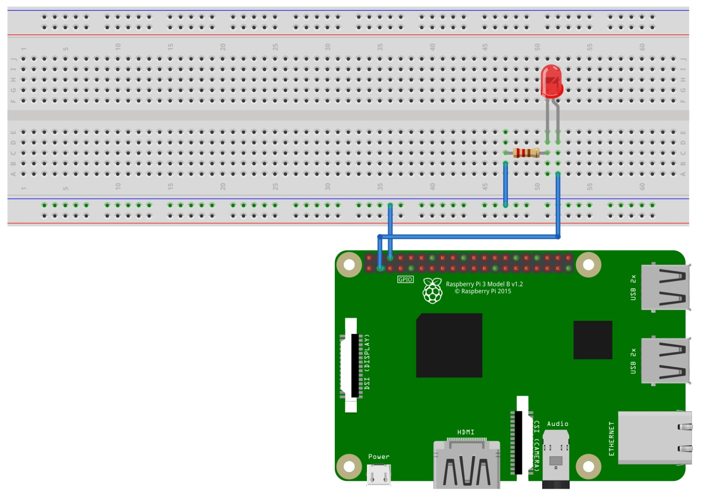

# P1-IntroRPi-PWM

This exercise consists on drive a [LED](https://github.com/clases-julio/p1-introrpi-pwm-dgarciac2021/wiki/LED) with the [GPIO](https://github.com/clases-julio/p1-introrpi-pwm-dgarciac2021/wiki/GPIO) available on the [Raspberry Pi 3B+](https://github.com/clases-julio/p1-introrpi-pwm-dgarciac2021/wiki/Raspberry-Pi#raspberry-pi-3b). You might want to take a look on the [wiki](https://github.com/clases-julio/p1-introrpi-pwm-dgarciac2021/wiki), since there is info of everything involved on this project. From the board itslef to the PWM method.


## Circuit Assembly

The assembly is pretty straight-forward. First of all, we connect the protoboard GND bus with the GND of the board. Next, we connect our `GPIO2` (Remember, **`GPIO2` equals to Board pin #3**, check the [wiki page](https://github.com/clases-julio/p1-introrpi-pwm-dgarciac2021/wiki/GPIO) for reference!) to the *anode* of the LED, and then a 220Ω[^1] resistor between its *cathode* and GND. This is an schematic made with [Fritzing](https://fritzing.org/):



And this is the real circuit!


## Code

1. First of all, import the neccesary libraries:

  ```python
  import RPi.GPIO as GPIO;
  import time
  ```

2. Next, we set the GPIO mode (`BCM` today!) and start the PWM mode on said pin. 

  ```python
  GPIO.setmode(GPIO.BCM)
  GPIO.setup(2, GPIO.OUT)
  pwm = GPIO.PWM(2, 100)
  pwm.start(0)
  ```
3. Here we set a infinite loop where the [duty cicle](https://github.com/clases-julio/p1-introrpi-pwm-dgarciac2021/wiki/PWM-Output#the-duty-cycle) of the PWM pin iterates from 25 to 100 and back, fading in and out the LED. We can cancel this loop if we strike <kbd>Ctrl</kbd> + <kbd>C</kbd> in our keyboard.

  ```python
  print ('Press CTRL+C to kill the program')
  while True:
    try:
      for i in range(25, 100):
        pwm.ChangeDutyCycle(i)
        time.sleep(0.01)
      for i in range(100, 25, -1):
        pwm.ChangeDutyCycle(i)
        time.sleep(0.01)
    except KeyboardInterrupt:
      print ('\nC ya!')
      break
  ```

4. Finally, before we exit the script, we undo all the actions that took place in the second step.. 

  ```python
  pwm.stop()
  GPIO.cleanup()
  ```

## Circuit testing

This is the result! Pretty nice, isn't it?


[^1]: The voltage for an *On* pin in the Raspberry Pi 3B+ is 3.3V, so a 220Ω will dim the LED a lot since it is calculated for a 5V supply. We can reduce the value of the resitor in order to increase the overall brightness of the LED **without exceeding its current limits**
